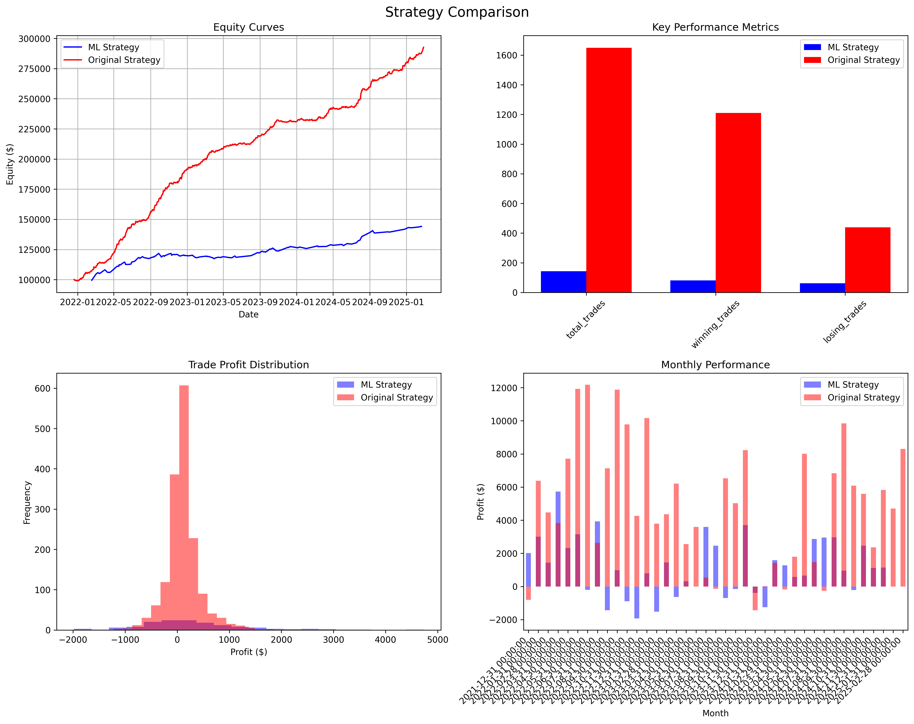

# ES Futures VPOC Strategy Backtester

## Overview
Advanced algorithmic trading strategy for E-mini S&P 500 (ES) futures that combines Volume Point of Control (VPOC) analysis with statistical validation. The strategy identifies high-probability trading opportunities by analyzing volume distribution patterns, value area migrations, and market microstructure.

## Strategy Performance (March 10, 2025)

### Original VPOC Strategy
- **Total Trades**: 1,649
- **Win Rate**: 73.38%
- **Total Profit**: $192,624.83
- **Profit Factor**: 3.04
- **Sharpe Ratio**: 5.31
- **Max Drawdown**: -1.00%

### ML-Enhanced Strategy
- **Total Trades**: 143
- **Win Rate**: 56.64%
- **Total Profit**: $44,116.45
- **Average Profit Per Trade**: $308.51 (vs $116.81 for original)
- **Profit Factor**: 2.34
- **Sharpe Ratio**: 4.52
- **Max Drawdown**: -3.60%

## Strategy Components

### Volume Profile Analysis
- Calculates price-volume distributions for each trading session
- Identifies VPOC (price level with highest trading volume)
- Determines Value Area (70% of volume) boundaries
- Tracks VPOC migrations to identify institutional price acceptance

### Machine Learning Enhancement
- **Neural Network Architecture**: Optimized for AMD GPUs with SiLU activation
- **Feature Engineering**: Comprehensive feature set including:
  - Price momentum (10, 20, 50-day windows)
  - Volatility metrics
  - Volume trends
  - VPOC migrations
  - Range evolution
- **Signal Generation**: ML-filtered signals with confidence thresholds
- **Performance**: Higher per-trade profitability with more selective entry criteria
- **Distributed Training**: Supports multi-GPU training with AMD ROCm optimization

### Trade Setup Requirements
- **Long Entries**:
  - Price testing Value Area Low (VAL)
  - Confirmed upward VPOC migration (slope >2.47)
  - Strong statistical validation (R² >0.69)
  - Higher timeframe momentum aligned (Bayesian prob >53%)
  - Volume profile showing accumulation pattern
  - ML confidence score above threshold (for ML strategy)

- **Short Entries**:
  - Price testing Value Area High (VAH)
  - Mirror conditions of long entries
  - Additional validation through volatility windows
  - Institutional selling pressure confirmed
  - ML confidence score above threshold (for ML strategy)

### Risk Management
- Position sizing based on account volatility
- Dynamic stops using ATR and value area boundaries
- Maximum exposure limits per trade
- Multiple timeframe validation
- Capital preservation rules

### Mathematical Validation
- **Trend Analysis**: Slope 2.47, R² 0.69
- **Volatility Windows**:
  - 10-day: 71.97
  - 20-day: 57.73
  - 50-day: 76.86
- **Bayesian Probabilities**:
  - Upward: 53.47%
  - Downward: 46.53%

## Project Structure
futures_vpoc_backtest/
├── src/                    # Refactored, modular implementation
│   ├── analysis/           # Analysis components
│   │   ├── __init__.py
│   │   ├── backtest.py     # Backtesting functionality
│   │   └── math_utils.py   # Mathematical utilities
│   ├── config/             # Configuration settings
│   │   ├── __init__.py
│   │   └── settings.py     # Global settings and constants
│   ├── core/               # Core functionality
│   │   ├── __init__.py
│   │   ├── data.py         # Data management utilities
│   │   ├── signals.py      # Trading signal generation
│   │   └── vpoc.py         # VPOC calculation utilities
│   ├── ml/                 # Machine learning components
│   │   ├── __init__.py
│   │   ├── distributed.py  # Distributed training functionality
│   │   ├── feature_engineering.py  # Feature extraction and selection
│   │   ├── model.py        # PyTorch model architecture
│   │   └── trainer.py      # Training orchestration
│   ├── scripts/            # Scripts and tests
│   │   ├── test_backtest.py        # Backtest unit tests
│   │   ├── test_data_loader.py     # Data loader unit tests
│   │   ├── test_distributed.py     # Distributed training unit tests
│   │   ├── test_feature_engineering.py  # Feature engineering unit tests
│   │   ├── test_ML_total.py        # Integration test
│   │   └── test_model.py           # Model architecture unit tests
│   ├── tests/              # Additional tests
│   └── utils/              # Utility functions
├── NOTEBOOKS/              # Original implementation
│   ├── VPOC.py            # Volume profile analysis & calculations
│   ├── STRATEGY.py        # Trading signal generation
│   ├── BACKTEST.py        # Performance testing & risk management
│   ├── MATH.py            # Statistical validation tools
│   ├── DATA_LOADER.py     # Data preprocessing utilities
│   ├── ML_TEST.py         # Original ML model architecture and training
│   └── ML_BACKTEST.py     # ML-enhanced backtesting framework
├── DATA/                  # Data directory (not included in repo)
├── TRAINING/              # Model training outputs (not included in repo)
└── .gitignore             # Git ignore rules

## Installation & Usage

1. **Setup Environment**

git clone https://github.com/lrud/futures_vpoc_backtest.git
cd futures_vpoc_backtest
python -m venv venv
source venv/bin/activate
pip install -r requirements.txt

2. **Run Original Analysis Pipeline**

cd NOTEBOOKS

# Generate VPOC and mathematical analysis
python VPOC.py      # Calculate volume profiles and value areas
python MATH.py      # Perform statistical validation

# Process and validate data
python DATA_LOADER.py  # Clean and prepare market data

# Generate signals and evaluate performance
python STRATEGY.py   # Generate trading signals with confidence scores
python BACKTEST.py   # Run performance analysis with risk management

3. **Use Refactored ML Components**

# Import components in your Python code
from src.core.data import FuturesDataManager
from src.ml.feature_engineering import prepare_features_and_labels
from src.ml.model import AMDOptimizedFuturesModel
from src.ml.distributed import AMDFuturesTensorParallel

# Load data
data_manager = FuturesDataManager()
data = data_manager.load_futures_data()

# Prepare features
X, y, feature_cols, scaler = prepare_features_and_labels(
    data, use_feature_selection=True, max_features=15
)

# Create and train model
model = AMDOptimizedFuturesModel(input_dim=len(feature_cols))

# For distributed training
trainer = AMDFuturesTensorParallel()
trainer.train_ddp(num_epochs=50, batch_size=64)

4. **Run Tests**

# Run unit tests for components
python -m src.scripts.test_distributed
python -m src.scripts.test_feature_engineering
python -m src.scripts.test_model
python -m src.scripts.test_backtest
python -m src.scripts.test_data_loader

# Run integration test
python -m src.scripts.test_ML_total

Each script performs specific tasks:
- VPOC.py: Generates volume profiles, VPOCs, and value areas
- MATH.py: Calculates trend slopes, R-squared values, and Bayesian probabilities
- DATA_LOADER.py: Preprocesses market data and validates data integrity
- STRATEGY.py: Combines analysis to generate high-probability trade signals
- BACKTEST.py: Tests strategy with realistic commission and slippage

## Dependencies
pandas==2.0.0
numpy==1.24.0
scipy==1.10.0
matplotlib==3.7.0
seaborn==0.12.2
pandas-ta==0.3.14b
statsmodels==0.14.0
torch>=2.0.0
scikit-learn>=1.0.0

## ML Refactoring Notes

The ML components have been refactored from the original monolithic ML_TEST.py script into modular components:

- **Feature Engineering**: Extracts and selects features from raw futures data
- **Model Architecture**: PyTorch neural network optimized for AMD GPUs
- **Distributed Training**: Multi-GPU training using PyTorch's DDP
- **Model Management**: Utilities for saving and loading models with metadata

This refactoring improves:
- **Maintainability**: Easier to understand and modify individual components
- **Testability**: Each component has dedicated unit tests
- **Extensibility**: New features can be added without modifying existing code

## License
MIT License - See LICENSE file for details